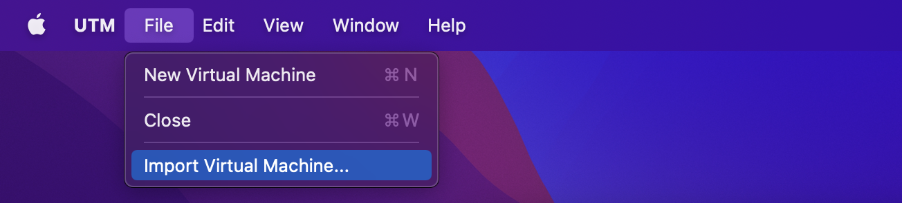
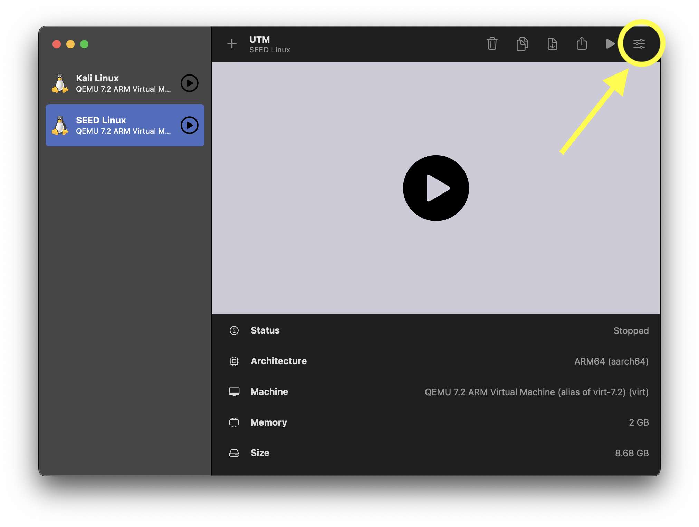
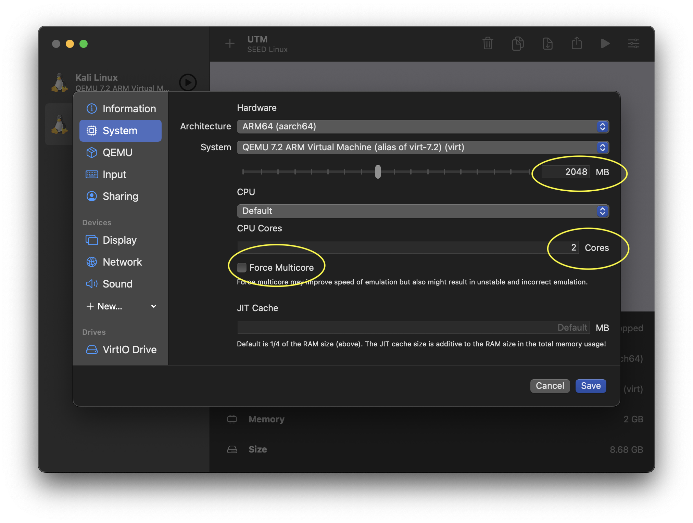
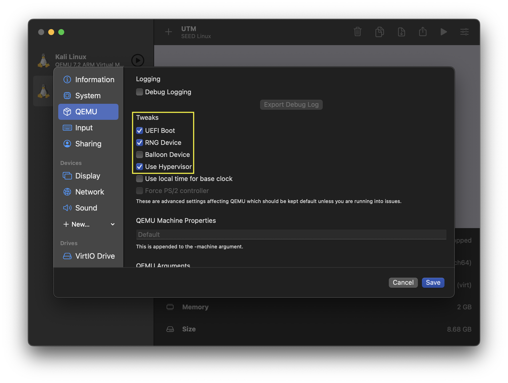
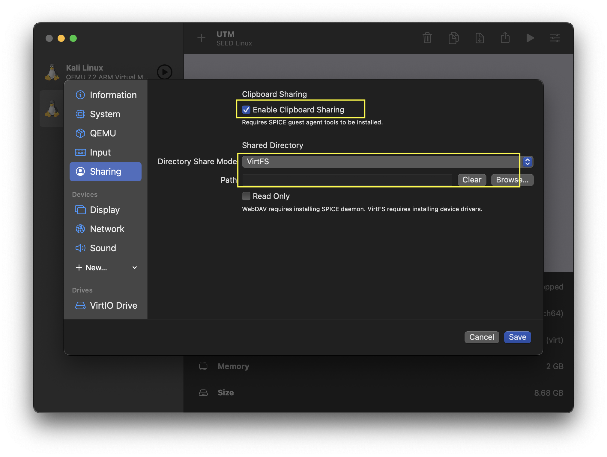
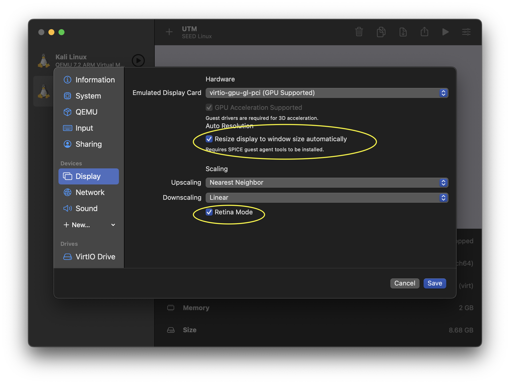
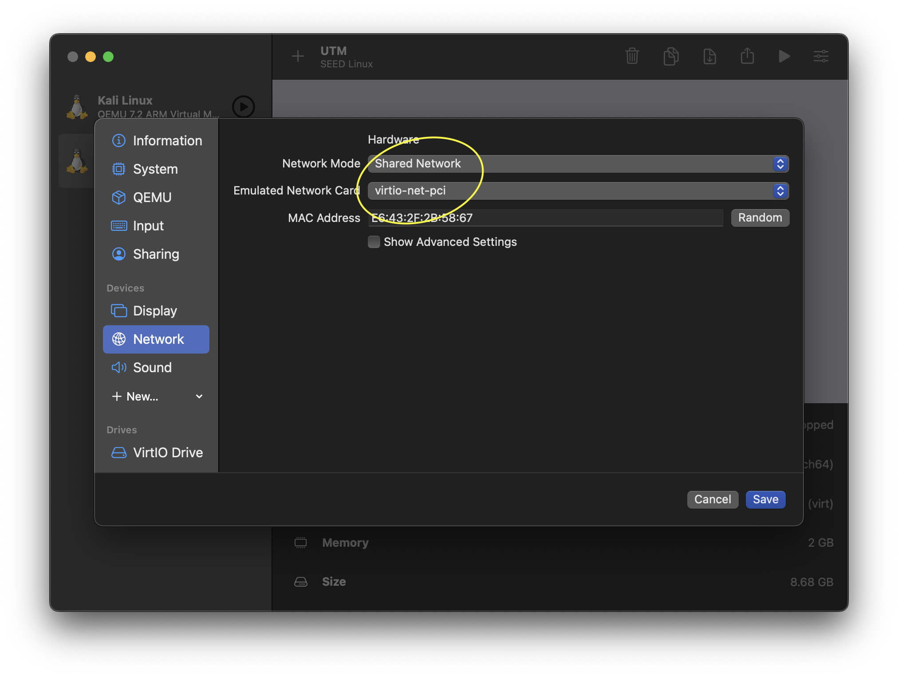

# Secure Software Development Environment

This development environment only supports ARM-based systems like Apple Silicon on the newer MacBook generations. **x86-64 archetecture is NOT supported**. Fully configured and ready to import with [UTM](https://mac.getutm.app/).

## Why can't I use the already-provided environment?
The already-provided environment only supports x86-64 systems because it was compiled on a different architecture. If you try to download the classroom-given image then you will not be able to run it. Additionally, there is only one application that is capable of virtualizing different operating systems on Apple silicon and that application is [UTM](https://mac.getutm.app/). Virtualbox does not currently support Apple Silicon. Another option: Parallels, is not a free software and it does not support the already-provided image in the class.

## Solution: Introducing Universal Turing Machine (UTM)
For MacBook users who are running on Apple Silicon, the solution is very simple and takes just **15-20 minutes of your time**. All you need to start developing is [UTM](https://mac.getutm.app/). What is UTM? Well, UTM is an application that allows you to virtualize almost any operating system on Apple Silicon hardware. You can emulate almost any operating system with high-performance too! There won't be any noticeable slowdowns when you are working on class assignments! Not only that, UTM is highly secure and supports the same features as VirtualBox. This image will run with near-native performance because I tuned the UTM configuration within the image I am providing to you to utilize Apple's Hypervisor virtualization framework. This means that your image will run faster than machines that utilize x86-64 chips (no guarantees)!

## Set Up and Installation
### Apple Silicon:
1. Download [UTM](https://mac.getutm.app/) then open the downloaded file and follow the instructions to install it
2. Download [the image](https://drive.google.com/file/d/16yB9sQu3UQ1nXqLO7BCxMFFvKGDZ24hd/view?usp=sharing) I built (Don't worry I built this image to be an exact clone of the class-provided one, every dependancy and libaray was rebuilt and recompiled to support ARM-based machines)
3. Unzip the image you downloaded to a location that is SAFE and SECURE (I suggest making a new folder and naming it as the class name)
4. Open UTM then select `file` -> `import virtual machine`

 

5. Find the image that you unzipped and import it into UTM.
6. Highlight the imported image in UTM then go to the image settings in the top right corner.

 

8. Ensure that the settings below match what you have, if not, then change them to match the settings in the images below.

 

 

 

 

## Once you are done with the steps, click "save" then click the massive play button to stay the image.

> **Warning**
> Please wait a bit for the image to start, EVEN IF it looks like nothing is happening, believe me, something is happnening...

# Signing Into the Image

### Locally on UTM
- Start the image then login using: 
- Username: `seed`
- Password: `dees`

> **Note**
> Everything below this line is completely optional and may only apply to Linux purists.

### SSH
- Start the image then login using: 
- Username: `seed`
- Password: `dees`
- Paste `hostname -I | awk '{print $1}'` into the console after logging in
- Copy the IP address that was returned
- Open up your favorite terminal (if you aren't using [Hyper](https://hyper.is/) you're missing out!) then paste this command in: `ssh seed@REPLACE_WITH_YOUR_IP_ADDRESS_FROM_ABOVE`
- Type `seed` for the password
- Congrats, you are now SSH'd into the environment!

## Questions?
Feel free to email me at mhozi18@georgefox.edu and I will be happy to help out with any issue you have OR reach out to your professor!
